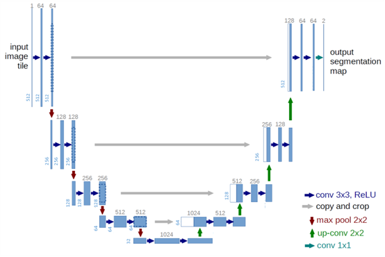
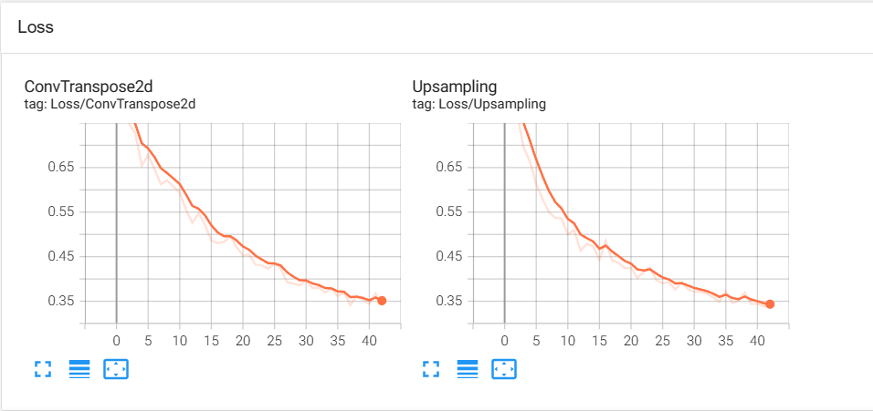
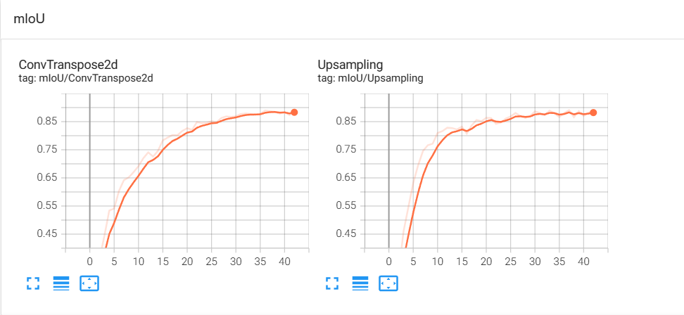
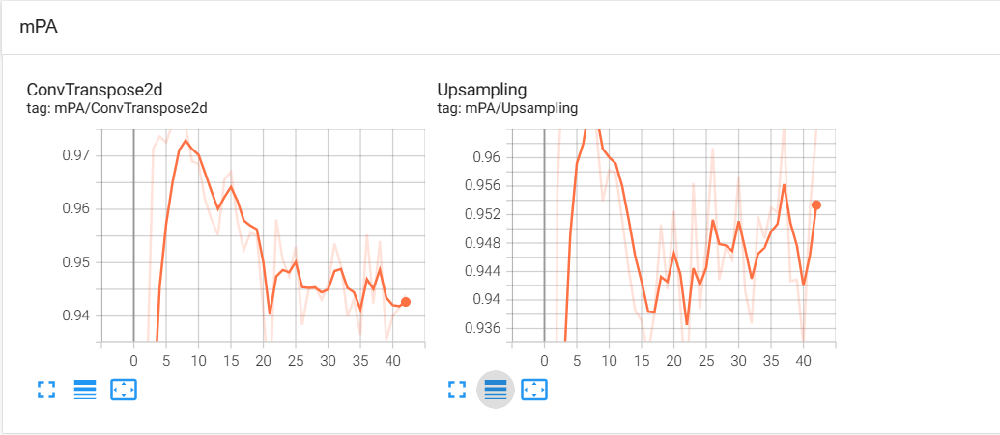
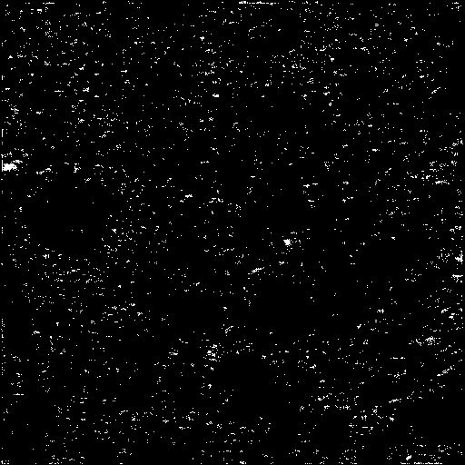
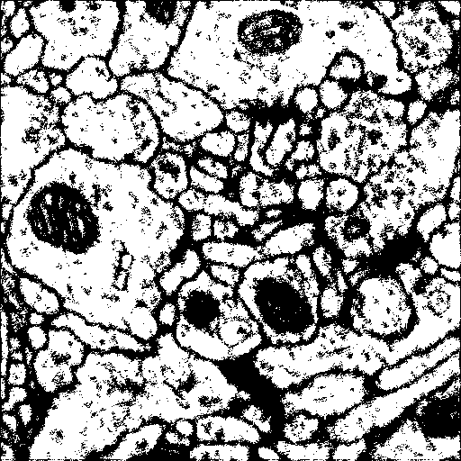

# UNet对细胞壁的分割（Pytorch）

项目主要采用`Pytorch`实现，并使用`tensorboard`作为直接可视化工具，方便看到整个模型的训练过程。


该项目主要使用`UNet`网络对`ISBI`数据集进行分割训练，并对不同的模块采用对比的方式比较效果。
主要对比的两个模块是
- `ConvTranspose`
- `Upsampling`


以下测评数据均在 $epoch = 6$ 的结果获得。


|        模块\指标        | **loss** | **mIoU** | **mPA** | result(若无法跳转，请直接下拉至底部)  |
|:-------------------:|:--------:|:--------:|:-------:|:-----------------------:|
| **ConvTranspose2d** |  0.3512  |  0.8832  | 0.9438  | [效果1](#ConvTranspose2d) |
|   **Upsampling**    |  0.3404  |  0.8874  | 0.9640  |   [效果2](#Upsampling)    |


这里从结果上看，由于`IBSI`数据集过于简单，`Upsampling`表现更佳，在既没有增加额外参数的同时 _推理时间_ 和 _性能_ 均优于`ConvTranspose2d`

但是 **转置卷积** 在**图像噪点去除的性能**上优于 `线性上采样Upsampling`（这一点我们可以对比分析效果1和效果2的动图）


## 效果查看
终端中输入如下命令，并在浏览器中访问 http://localhost:6006/
```bash
tensorboard --logdir='./logs'
```

### Loss
这里我使用的 *Loss* 都是 `CrossEntropyLoss`


### mIoU


### mPA



### ConvTranspose2d


### Upsampling

